# 企业级权限管理系统 - 数据库 ER 图

## 完整 ER 图

```mermaid
erDiagram
    %% 用户表
    USERS {
        bigint id PK "主键"
        varchar username UK "用户名 (登录账号)"
        varchar password "密码 (bcrypt 加密)"
        varchar email UK "邮箱"
        varchar phone UK "手机号"
        varchar nickname "昵称"
        bigint dept_id FK "所属部门"
        varchar avatar "头像 URL"
        tinyint status "状态：0 禁用 1 正常"
        datetime last_login_time "最后登录时间"
        varchar last_login_ip "最后登录 IP"
        datetime created_at "创建时间"
        datetime updated_at "更新时间"
    }

    %% 角色表
    ROLES {
        bigint id PK "主键"
        varchar name "角色名称"
        varchar code UK "角色编码"
        varchar description "角色描述"
        tinyint data_scope_type "数据范围类型"
        boolean is_system "是否系统内置 (不可删除)"
        datetime created_at "创建时间"
        datetime updated_at "更新时间"
    }

    %% 菜单表
    MENUS {
        bigint id PK "主键"
        varchar name "菜单名称"
        varchar code UK "菜单编码"
        bigint parent_id FK "父菜单 ID"
        varchar path "路由路径"
        varchar component "前端组件路径"
        varchar icon "菜单图标"
        tinyint type "类型：1 目录 2 菜单 3 外链"
        tinyint sort_order "排序"
        boolean visible "是否可见"
        varchar permission "关联权限标识"
        datetime created_at "创建时间"
        datetime updated_at "更新时间"
    }

    %% 功能权限表
    PERMISSIONS {
        bigint id PK "主键"
        varchar name "权限名称"
        varchar code UK "权限编码 (如：user:add)"
        bigint menu_id FK "所属菜单"
        varchar type "类型：button(按钮) api(接口)"
        varchar api_method "HTTP 方法：GET/POST/PUT/DELETE"
        varchar api_path "API 路径"
        varchar description "权限描述"
        datetime created_at "创建时间"
        datetime updated_at "更新时间"
    }

    %% 数据权限规则表
    DATA_SCOPES {
        bigint id PK "主键"
        varchar name "规则名称"
        varchar code UK "规则编码"
        tinyint scope_type "范围类型"
        json scope_config "范围配置 (JSON)"
        varchar description "规则描述"
        datetime created_at "创建时间"
        datetime updated_at "更新时间"
    }

    %% 部门表
    DEPARTMENTS {
        bigint id PK "主键"
        varchar name "部门名称"
        bigint parent_id FK "父部门 ID"
        varchar leader_name "部门负责人"
        varchar phone "部门电话"
        varchar email "部门邮箱"
        tinyint sort_order "排序"
        varchar full_path "完整路径 (用于查询)"
        datetime created_at "创建时间"
        datetime updated_at "更新时间"
    }

    %% ================= 关联表 =================

    %% 用户 - 角色关联 (多对多)
    USER_ROLES {
        bigint user_id PK,FK "用户 ID"
        bigint role_id PK,FK "角色 ID"
        datetime created_at "授权时间"
    }

    %% 用户 - 部门关联 (支持多部门)
    USER_DEPARTMENTS {
        bigint user_id PK,FK "用户 ID"
        bigint dept_id PK,FK "部门 ID"
        boolean is_primary "是否主部门"
    }

    %% 角色 - 菜单权限关联
    ROLE_MENUS {
        bigint role_id PK,FK "角色 ID"
        bigint menu_id PK,FK "菜单 ID"
    }

    %% 角色 - 功能权限关联
    ROLE_PERMISSIONS {
        bigint role_id PK,FK "角色 ID"
        bigint permission_id PK,FK "权限 ID"
    }

    %% 角色 - 数据权限关联
    ROLE_DATA_SCOPES {
        bigint role_id PK,FK "角色 ID"
        bigint data_scope_id PK,FK "数据权限 ID"
    }

    %% 用户 - 直接功能权限 (特殊授权，超越角色)
    USER_PERMISSIONS {
        bigint user_id PK,FK "用户 ID"
        bigint permission_id PK,FK "权限 ID"
        tinyint grant_type "授权类型：1 允许 2 拒绝"
    }

    %% 用户 - 直接数据权限 (特殊授权)
    USER_DATA_SCOPES {
        bigint user_id PK,FK "用户 ID"
        bigint data_scope_id PK,FK "数据权限 ID"
    }

    %% 登录日志表
    LOGIN_LOGS {
        bigint id PK "主键"
        bigint user_id FK "用户 ID"
        varchar username "登录用户名"
        varchar ip_address "登录 IP"
        varchar user_agent "浏览器信息"
        varchar login_status "登录状态：success/fail"
        varchar fail_reason "失败原因"
        datetime login_time "登录时间"
    }

    %% 操作日志表
    OPERATION_LOGS {
        bigint id PK "主键"
        bigint user_id FK "用户 ID"
        varchar username "操作人"
        varchar module "操作模块"
        varchar operation "操作类型"
        varchar method "请求方法"
        varchar request_url "请求 URL"
        text request_params "请求参数"
        varchar ip_address "操作 IP"
        bigint duration_ms "执行耗时 (ms)"
        varchar status "状态：success/fail"
        text error_msg "错误信息"
        datetime operation_time "操作时间"
    }

    %% ================= 关系定义 =================

    USERS ||--o{ USER_ROLES : "拥有"
    ROLES ||--o{ USER_ROLES : "被赋予"

    USERS }o--|| DEPARTMENTS : "属于"
    USERS ||--o{ USER_DEPARTMENTS : "关联部门"
    DEPARTMENTS ||--o{ USER_DEPARTMENTS : "关联用户"

    ROLES ||--o{ ROLE_MENUS : "包含菜单"
    MENUS ||--o{ ROLE_MENUS : "被角色赋予"

    ROLES ||--o{ ROLE_PERMISSIONS : "包含权限"
    PERMISSIONS ||--o{ ROLE_PERMISSIONS : "被角色拥有"

    ROLES ||--o{ ROLE_DATA_SCOPES : "绑定数据权限"
    DATA_SCOPES ||--o{ ROLE_DATA_SCOPES : "被角色绑定"

    USERS ||--o{ USER_PERMISSIONS : "直接权限"
    PERMISSIONS ||--o{ USER_PERMISSIONS : "直接赋予用户"

    USERS ||--o{ USER_DATA_SCOPES : "直接数据权限"
    DATA_SCOPES ||--o{ USER_DATA_SCOPES : "直接赋予用户"

    USERS ||--o{ LOGIN_LOGS : "登录记录"
    USERS ||--o{ OPERATION_LOGS : "操作记录"

    MENUS ||--o{ MENUS : "父子关系 (自关联)"
    DEPARTMENTS ||--o{ DEPARTMENTS : "上下级 (自关联)"
    PERMISSIONS ||--|{ MENUS : "归属于"
```



---

## 表结构详细说明

### 1. 核心业务表

#### `users` - 用户表
| 字段 | 类型 | 说明 |
|------|------|------|
| id | bigint | 主键 |
| username | varchar(50) | 登录账号，唯一 |
| password | varchar(255) | bcrypt 加密密码 |
| email | varchar(100) | 邮箱，唯一 |
| phone | varchar(20) | 手机号，唯一 |
| nickname | varchar(50) | 昵称 |
| dept_id | bigint | 主部门 ID |
| avatar | varchar(500) | 头像 URL |
| status | tinyint | 0-禁用，1-正常 |
| last_login_time | datetime | 最后登录时间 |
| last_login_ip | varchar(50) | 最后登录 IP |

#### `roles` - 角色表
| 字段 | 类型 | 说明 |
|------|------|------|
| id | bigint | 主键 |
| name | varchar(50) | 角色名称 |
| code | varchar(50) | 角色编码，唯一 (如：admin, manager) |
| description | varchar(255) | 角色描述 |
| data_scope_type | tinyint | 默认数据范围类型 |
| is_system | boolean | 是否系统内置 (不可删除) |

#### `menus` - 菜单表
| 字段 | 类型 | 说明 |
|------|------|------|
| id | bigint | 主键 |
| name | varchar(50) | 菜单名称 |
| code | varchar(50) | 菜单编码，唯一 |
| parent_id | bigint | 父菜单 ID (0 表示顶级) |
| path | varchar(200) | 路由路径 |
| component | varchar(200) | 前端组件路径 |
| icon | varchar(50) | 菜单图标 |
| type | tinyint | 1-目录，2-菜单，3-外链 |
| sort_order | tinyint | 排序 (从小到大) |
| visible | boolean | 是否可见 |

#### `permissions` - 功能权限表
| 字段 | 类型 | 说明 |
|------|------|------|
| id | bigint | 主键 |
| name | varchar(50) | 权限名称 |
| code | varchar(100) | 权限编码，唯一 (如：user:add) |
| menu_id | bigint | 所属菜单 ID |
| type | varchar(20) | button(按钮) 或 api(接口) |
| api_method | varchar(10) | GET/POST/PUT/DELETE |
| api_path | varchar(200) | API 路径 |

#### `data_scopes` - 数据权限规则表
| 字段 | 类型 | 说明 |
|------|------|------|
| id | bigint | 主键 |
| name | varchar(50) | 规则名称 |
| code | varchar(50) | 规则编码，唯一 |
| scope_type | tinyint | 范围类型 (见下表) |
| scope_config | json | 范围配置 (JSON 格式) |

**数据范围类型 (`scope_type`)**:
| 值 | 类型 | 说明 | SQL 过滤示例 |
|---|------|------|-------------|
| 1 | ALL | 全部数据 | 无过滤 |
| 2 | ORG_AND_CHILD | 本部门及子部门 | `dept_id IN (递归查询子部门)` |
| 3 | ORG_SELF | 仅本部门 | `dept_id = 当前部门` |
| 4 | SELF | 仅本人 | `creator_id = 当前用户` |
| 5 | CUSTOM | 自定义范围 | `dept_id IN (自定义部门列表)` |

#### `departments` - 部门表
| 字段 | 类型 | 说明 |
|------|------|------|
| id | bigint | 主键 |
| name | varchar(50) | 部门名称 |
| parent_id | bigint | 父部门 ID (0 表示顶级) |
| leader_name | varchar(50) | 部门负责人 |
| phone | varchar(20) | 联系电话 |
| email | varchar(100) | 部门邮箱 |
| sort_order | tinyint | 排序 |
| full_path | varchar(500) | 完整路径 (如：/1/5/12/) |

---

### 2. 关联表

| 关联表 | 说明 |
|--------|------|
| `user_roles` | 用户 - 角色多对多关联 |
| `user_departments` | 用户 - 部门关联 (支持多部门) |
| `role_menus` | 角色 - 菜单权限关联 |
| `role_permissions` | 角色 - 功能权限关联 |
| `role_data_scopes` | 角色 - 数据权限规则关联 |
| `user_permissions` | 用户直接功能权限 (特殊授权) |
| `user_data_scopes` | 用户直接数据权限 (特殊授权) |

---

### 3. 日志表

| 日志表 | 说明 |
|--------|------|
| `login_logs` | 用户登录日志 (成功/失败) |
| `operation_logs` | 用户操作日志 (审计用) |

---

## 权限计算逻辑

### 用户最终菜单权限
```python
def get_user_menus(user_id):
    # 1. 获取用户所有角色
    roles = get_user_roles(user_id)

    # 2. 获取角色关联的所有菜单
    menu_ids = set()
    for role in roles:
        menu_ids.update(get_role_menus(role.id))

    # 3. 按树形结构返回 (递归包含父菜单)
    return build_menu_tree(menu_ids)
```

### 用户最终功能权限
```python
def get_user_permissions(user_id):
    permissions = set()

    # 1. 累加所有角色的权限
    for role in get_user_roles(user_id):
        permissions.update(get_role_permissions(role.id))

    # 2. 加上用户直接权限 (允许)
    permissions.update(get_user_direct_permissions(user_id, grant_type='ALLOW'))

    # 3. 减去用户拒绝的权限
    permissions -= get_user_direct_permissions(user_id, grant_type='DENY')

    return permissions
```

### 用户最终数据权限
```python
def get_user_data_scopes(user_id):
    data_scopes = []

    # 1. 获取角色绑定的数据权限
    for role in get_user_roles(user_id):
        data_scopes.extend(get_role_data_scopes(role.id))

    # 2. 加上用户直接数据权限
    data_scopes.extend(get_user_direct_data_scopes(user_id))

    # 3. 合并数据范围 (取并集)
    return merge_data_scopes(data_scopes)
```

---

## 索引设计

```sql
-- 用户表索引
CREATE INDEX idx_users_dept_id ON users(dept_id);
CREATE INDEX idx_users_status ON users(status);
CREATE UNIQUE INDEX idx_users_username ON users(username);
CREATE UNIQUE INDEX idx_users_email ON users(email);
CREATE UNIQUE INDEX idx_users_phone ON users(phone);

-- 角色表索引
CREATE UNIQUE INDEX idx_roles_code ON roles(code);

-- 菜单表索引
CREATE INDEX idx_menus_parent_id ON menus(parent_id);
CREATE INDEX idx_menus_type ON menus(type);
CREATE UNIQUE INDEX idx_menus_code ON menus(code);

-- 权限表索引
CREATE UNIQUE INDEX idx_permissions_code ON permissions(code);
CREATE INDEX idx_permissions_menu_id ON permissions(menu_id);

-- 部门表索引
CREATE INDEX idx_depts_parent_id ON departments(parent_id);
CREATE INDEX idx_depts_full_path ON departments(full_path);

-- 关联表索引
CREATE INDEX idx_user_roles_user ON user_roles(user_id);
CREATE INDEX idx_user_roles_role ON user_roles(role_id);
CREATE UNIQUE INDEX idx_uk_user_role ON user_roles(user_id, role_id);

CREATE INDEX idx_role_perms_role ON role_permissions(role_id);
CREATE INDEX idx_role_perms_perm ON role_permissions(permission_id);

CREATE INDEX idx_user_perms_user ON user_permissions(user_id);
CREATE INDEX idx_user_perms_perm ON user_permissions(permission_id);
```
